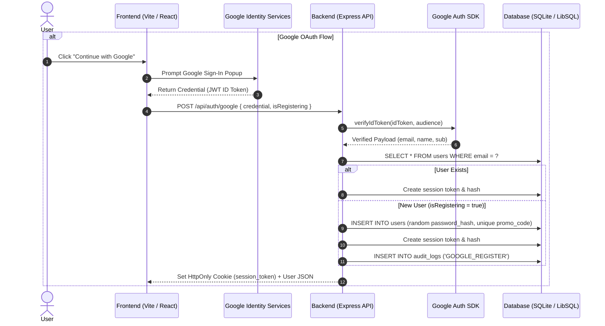

# Authentication & Google OAuth Structure Documentation

This document outlines the detailed technical architecture, data flows, database models, API contracts, frontend component interactions, and security protocols for the **Login & Sign-Up system integrated with Google OAuth 2.0** in **Dear Diary**.

---

## 1. System Architecture Overview

Dear Diary implements a dual-authentication strategy:

1. **Standard Email & Password Authentication** (Bcrypt-hashed credentials).
2. **Google OAuth 2.0 / Identity Services** (JWT ID Token verification via Google's `google-auth-library`).

Session management is uniform across both authentication methods: a cryptographically secure 32-byte token stored in a `SameSite=Lax`, `HttpOnly` cookie, with SHA-256 token hashes persisted in the server database.



---

## 2. Data Models & Database Schema

The authentication system relies on four primary database tables:

### 2.1 `users`

Stores user profile information, authentication credentials, and auto-generated promo code links.

```sql
CREATE TABLE IF NOT EXISTS users (
    id TEXT PRIMARY KEY,
    email TEXT UNIQUE NOT NULL,
    password_hash TEXT NOT NULL,
    display_name TEXT,
    promo_code TEXT UNIQUE NOT NULL,
    status TEXT DEFAULT 'active',
    created_at DATETIME NOT NULL DEFAULT CURRENT_TIMESTAMP,
    updated_at DATETIME NOT NULL DEFAULT CURRENT_TIMESTAMP
);

CREATE INDEX IF NOT EXISTS idx_users_promo ON users (promo_code);
```

_Note: For Google OAuth users, `password_hash` is initialized with a high-entropy random 32-byte string hashed via Bcrypt to ensure the account cannot be logged into via empty/default password attempts._

### 2.2 `sessions`

Tracks active user authentication sessions. Raw tokens are never stored; only their SHA-256 hashes are persisted to mitigate token theft in case of database leaks.

```sql
CREATE TABLE IF NOT EXISTS sessions (
    id TEXT PRIMARY KEY,
    user_id TEXT NOT NULL REFERENCES users(id) ON DELETE CASCADE,
    token_hash TEXT UNIQUE NOT NULL,
    created_at DATETIME NOT NULL DEFAULT CURRENT_TIMESTAMP,
    expires_at DATETIME NOT NULL,
    revoked_at DATETIME,
    last_seen_at DATETIME DEFAULT CURRENT_TIMESTAMP
);
```

### 2.3 `user_connections` (Promo Code Connections)

Linked during registration if a promo code is provided.

```sql
CREATE TABLE IF NOT EXISTS user_connections (
    id TEXT PRIMARY KEY,
    user_a TEXT NOT NULL REFERENCES users(id) ON DELETE CASCADE,
    user_b TEXT NOT NULL REFERENCES users(id) ON DELETE CASCADE,
    created_at DATETIME NOT NULL DEFAULT CURRENT_TIMESTAMP,
    CONSTRAINT chk_diff_users CHECK (user_a <> user_b)
);
```

### 2.4 `audit_logs`

Records security and authentication events for auditing.

```sql
CREATE TABLE IF NOT EXISTS audit_logs (
    id TEXT PRIMARY KEY,
    actor_user_id TEXT REFERENCES users(id) ON DELETE SET NULL,
    action TEXT NOT NULL,         -- e.g., 'USER_REGISTER', 'GOOGLE_REGISTER', 'USER_LOGIN'
    resource_type TEXT NOT NULL,  -- e.g., 'user'
    resource_id TEXT,             -- Target user ID
    metadata TEXT,
    created_at DATETIME NOT NULL DEFAULT CURRENT_TIMESTAMP
);
```

---

## 3. Detailed Component Structure

### 3.1 Frontend Component Layer (`frontend/src/components/ui/sign-in.tsx`)

The authentication UI component manages both standard password authentication and Google OAuth 2.0 flow rendering.

#### Core UI Components:

1. **`GoogleSignInButton`**:
   - Dynamically loads or checks for Google Identity Services SDK script (`https://accounts.google.com/gsi/client`).
   - Initializes `window.google.accounts.id.initialize` with `client_id` (`VITE_GOOGLE_CLIENT_ID`).
   - Mounts Google's official rendering button via `renderButton`.
   - Captures the callback response (`response.credential`) and fires `onGoogleCredential(credential)`.
   - Displays a configuration helper alert if `VITE_GOOGLE_CLIENT_ID` is missing.

2. **`SignInPage`**:
   - Provides a unified form interface with toggleable modes (`Sign In` vs `Create Account`).
   - Supports optional pre-filled Google registration state (`googleRegData`).
   - Handles password input visibility toggle.
   - Includes promo code link field during registration mode.

```typescript
export interface SignInPageProps {
  title?: React.ReactNode;
  description?: React.ReactNode;
  heroImageSrc?: string;
  testimonials?: Testimonial[];
  onSignIn?: (event: React.FormEvent<HTMLFormElement>) => void;
  onGoogleCredential?: (credential: string) => void;
  googleClientId?: string;
  onResetPassword?: () => void;
  onCreateAccount?: () => void;
  isRegistering?: boolean;
  googleRegData?: { email: string; displayName: string } | null;
  onClearGoogleReg?: () => void;
}
```

---

## 4. API Endpoints & Request / Response Specifications

Backend routes are implemented in [`backend/routes/auth.js`](file:///e:/Projects/Web/Dear_Diary/backend/routes/auth.js).

### 4.1 Google Sign-In & Sign-Up Endpoint

- **URL**: `POST /api/auth/google`
- **Authentication**: Public
- **Request Body**:

```json
{
  "credential": "<GOOGLE_JWT_ID_TOKEN>",
  "isRegistering": true
}
```

- **Execution Workflow**:
  1. Validates presence of `credential` and server-side `GOOGLE_CLIENT_ID`.
  2. Verifies `credential` token using `google-auth-library` `OAuth2Client.verifyIdToken`.
  3. Extracts verified `email` and `name` from JWT payload.
  4. Queries database `users` table by `email`.
  5. **If User Found**: Logs in existing user, creates session token, sets `session_token` cookie.
  6. **If User Not Found & `isRegistering: true`**:
     - Generates UUID for `userId`.
     - Generates secure random Bcrypt password hash.
     - Auto-generates unique `promo_code`.
     - Inserts record into `users` table.
     - Logs `GOOGLE_REGISTER` in `audit_logs`.
     - Generates session token, stores hash in `sessions`, sets `session_token` cookie.
  7. **If User Not Found & `isRegistering: false`**: Returns HTTP `401 Unauthorized` with instruction to register.
- **Success Response (HTTP 200/201)**:

```json
{
  "message": "Google Sign-In successful.",
  "user": {
    "id": "uuid-v4-string",
    "email": "user@example.com",
    "displayName": "User Name",
    "promoCode": "JOURNAL-X79K"
  }
}
```

- **Error Response Examples**:
  - Missing token: `400 Bad Request` -> `{ "error": "Missing Google credential token." }`
  - Unconfigured backend: `503 Service Unavailable` -> `{ "error": "Google Sign-In is not configured on this server..." }`
  - Invalid JWT signature: `401 Unauthorized` -> `{ "error": "Invalid or expired Google credential." }`

---

### 4.2 Standard Email & Password Registration

- **URL**: `POST /api/auth/register`
- **Request Body**:

```json
{
  "email": "user@example.com",
  "password": "SecurePassword123",
  "displayName": "Alex",
  "promoCode": "JOURNAL-ABC1"
}
```

- **Key Logic**:
  - Validates minimum 8-character password.
  - Hashes password using `bcryptjs` with salt round `12`.
  - Generates unique promo code.
  - Processes promo code linkage atomically via database transaction if valid.
  - Automatically logs user in by generating session cookie.

---

### 4.3 Standard Login

- **URL**: `POST /api/auth/login`
- **Request Body**:

```json
{
  "email": "user@example.com",
  "password": "SecurePassword123"
}
```

- **Key Logic**:
  - Compares password against stored `password_hash` using `bcrypt.compare`.
  - Creates 30-day session record and sets `HttpOnly` cookie.

---

### 4.4 Session Verification

- **URL**: `GET /api/auth/session`
- **Headers/Cookies**: `session_token` HTTP Cookie
- **Response**: Returns active user context if valid, or `401 Unauthorized`.

---

### 4.5 Logout

- **URL**: `POST /api/auth/logout`
- **Action**: Revokes session in `sessions` database table (`revoked_at = CURRENT_TIMESTAMP`) and clears `session_token` cookie.

---

## 5. Security & Privacy Guarantees

1. **Session Cookie Security**:
   - `HttpOnly`: Prevents client-side XSS access to raw session tokens.
   - `SameSite=Lax`: Protects against Cross-Site Request Forgery (CSRF).
   - `Secure`: Enforced in production (`process.env.NODE_ENV === 'production'`).
2. **Server-Side Token Verification**:
   - Google ID Tokens are cryptographically verified against Google's official public keys using `google-auth-library`.
   - Client ID (`audience`) check prevents token misuse across different applications.
3. **Database Token Hashing**:
   - Session tokens are stored in the database as SHA-256 hashes (`hashToken(rawToken)`). Raw tokens exist only in memory and in client HTTP-only cookies.
4. **Account Enumeration & IDOR Protection**:
   - Authentication middlewares strictly derive identity from validated session cookies rather than client-supplied parameters.
5. **Data Minimization**:
   - API endpoints exclude password hashes, raw tokens, and internal metadata from responses.

---

## 6. Environment Configuration

### Backend Setup (`backend/.env`)

```env
PORT=5000
NODE_ENV=development
GOOGLE_CLIENT_ID=your-google-oauth-client-id.apps.googleusercontent.com
```

### Frontend Setup (`frontend/.env`)

```env
VITE_GOOGLE_CLIENT_ID=your-google-oauth-client-id.apps.googleusercontent.com
```
